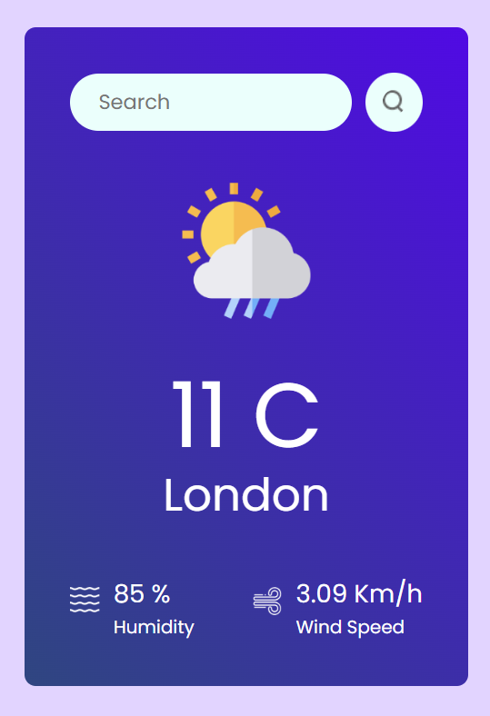
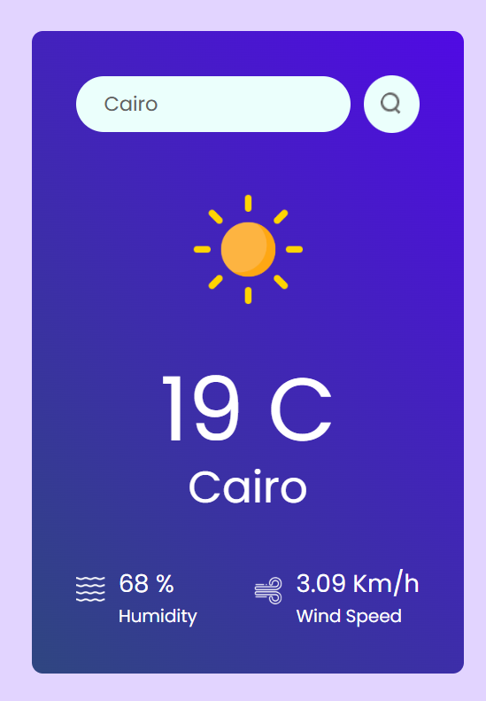
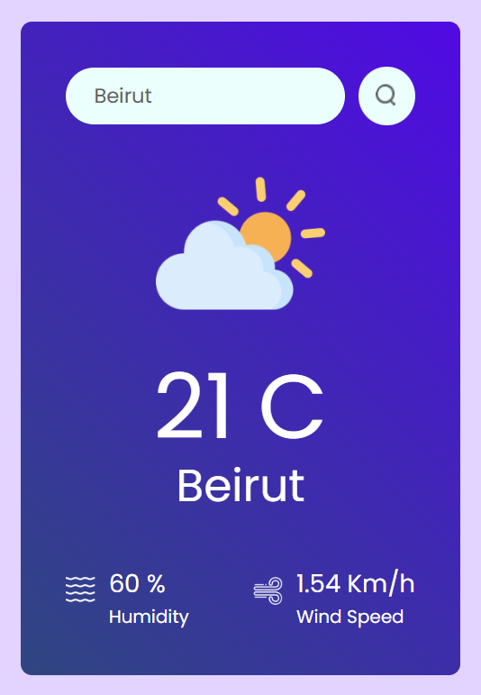

بالطبع ✅ إليك الملف الكامل ضمن خلية واحدة قابلة للنسخ المباشر:

````markdown
# React Weather App

A sleek and modern **React.js** weather application that allows users to search for current weather conditions by city name.  
The app displays real-time temperature, humidity, wind speed, and weather icons — all with a clean, responsive interface.

---

## UI Preview

<div align="center">
  
  
  
</div>

---

## Overview

This weather app provides a fast and simple way to check live weather updates for any city:

- Search for a city to get its current weather
- View **temperature**, **humidity**, and **wind speed**
- Dynamic **weather icons** (sunny, cloudy, rainy, snowy, etc.)
- Automatically loads **London weather** on startup
- Displays alerts for invalid city names or API errors

---

## Technologies Used

- **React.js** – For building the user interface
- **OpenWeatherMap API** – To fetch live weather data
- **CSS3** – For custom styling and responsive layout
- **Vite** – For fast development and build environment
- **useState / useEffect / useRef** – React Hooks for managing app state and lifecycle

---

## How It Works

1. User enters a **city name** in the search bar
2. App sends a request to the **OpenWeather API**
3. If valid, it displays:
   - City name
   - Temperature in °C
   - Humidity percentage
   - Wind speed in Km/h
   - Appropriate weather icon
4. If invalid, it alerts the user with an error message

---

## Components

- **Weather.jsx** → Main logic and UI rendering of the weather app
- **Weather.css** → Handles layout, icons, and styling
- **Assets** → Contains all weather icons (clear, rain, snow, etc.)

---

## Features & Design

- 🔍 **Search-based city lookup**
- ☀️ **Dynamic weather icons** (clear, cloud, drizzle, rain, snow)
- 🌍 **API-powered real-time data**
- 💨 Displays **humidity** and **wind speed**
- ⚡ Responsive design for all devices
- 🌇 Default city: **London**

---

## Run Locally

```bash
git clone https://github.com/sahiralzakaria/React-Weather-App.git
cd React-Weather-App
npm install
npm run dev
```

Then open [http://localhost:5173](http://localhost:5173) in your browser.

> ⚙️ **Note:**  
> You must create a `.env` file in your project root and add your API key:
>
> ```env
> VITE_APP_ID=your_openweather_api_key
> ```

---

## Future Improvements

- Add **5-day forecast** feature
- Support for **light/dark themes**
- Show **sunrise/sunset times**
- Auto-detect **current location weather**
- Multi-language support (English / Arabic)

---

## Author

- [](https://github.com/sahiralzakaria) **GitHub:** [sahiralzakaria](https://github.com/sahiralzakaria)
- [](https://www.linkedin.com/in/sahir-zakaria-39873531b) **LinkedIn:** [sahir-zakaria](https://www.linkedin.com/in/sahir-zakaria-39873531b)
- [](mailto:sahir.alzakaria@gmail.com) **Email:** sahir.alzakaria@gmail.com

---

<div align="center">
  <p>Made with ☁️ and ❤️ by <strong>Sahir Zakaria</strong></p>
  <p><em>Stay informed. Stay weather-wise! 🌦️</em></p>
</div>
````
